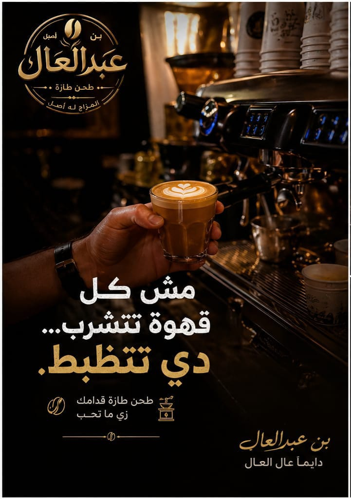
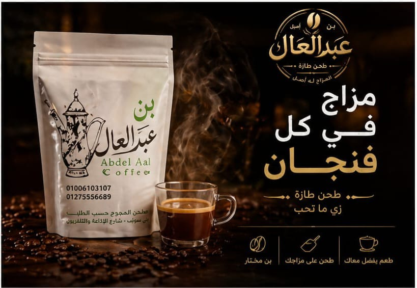
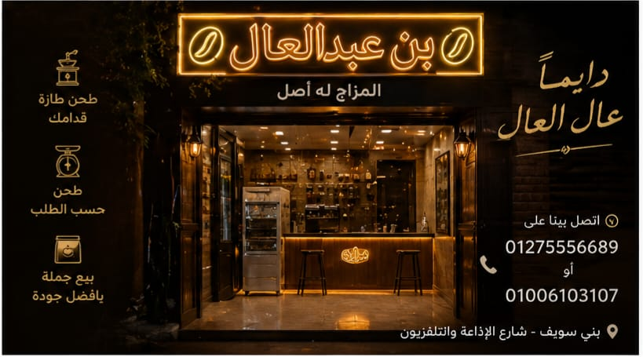

# Abdel Aal Coffee

**A self-directed coffee concept combining web execution, brand composition, visual direction, and motion material.**

[Live website](https://abdel-aal-coffee.vercel.app) · [Portfolio case study](https://omar-khair-portfolio.vercel.app/work/abdel-aal-coffee)

  
  
  

## Project

Abdel Aal Coffee is a creative web/brand experiment rather than a large software system. The repository is useful as evidence of visual composition, coffee-brand direction, static web execution, and motion/video integration.

## What it includes

- branded landing-page composition;
- product and store presentation;
- custom HTML/CSS/JavaScript implementation;
- image-led storytelling;
- motion/video assets integrated into the web direction.

## Stack

- HTML
- CSS
- JavaScript
- Image and video assets

## Repository structure

- `index.html` — main experience
- `style.css` — visual system and layout
- `script.js` — client-side interaction
- `images/` — supporting visual assets
- `videos/` and `videosloop.mp4` — motion material

## Status

**Live creative project.**

It is presented in the portfolio as creative/visual-direction evidence rather than as a flagship engineering system.
